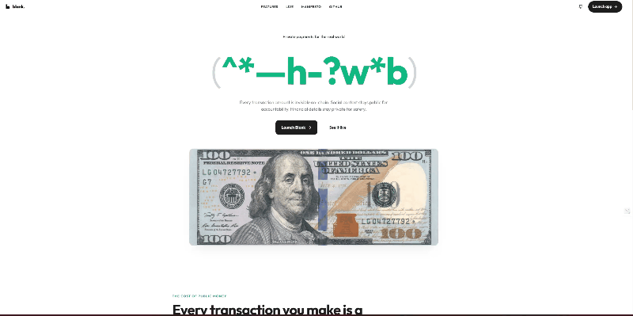

<div align="center">


<br /><br />

# Blank

### Send a private invoice. Get paid privately.

**Same chain. Same finality. Different visibility.**

</div>

| What everyone sees on Etherscan today | What everyone sees on Blank |
|---|---|
| `0xAlice → 0xBob:` &nbsp; `5,200.00 USDC` | `0xAlice → 0xBob:` &nbsp; `████.██ USDC` |
| `0xCarol → 0xDave:` &nbsp; `12.50 USDC` | `0xCarol → 0xDave:` &nbsp; `████.██ USDC` |
| `0xEve → 0xFrank:` &nbsp; `87,500.00 USDC` | `0xEve → 0xFrank:` &nbsp; `████.██ USDC` |

<div align="center">

Blank is encrypted payments on Ethereum. Amounts are FHE-encrypted before
they touch the chain; smart contracts add, compare, and transfer ciphertext;
sender and receiver decrypt with their own keys. Everyone else sees ████.

[**Launch the app →**](https://blank-omega-jade.vercel.app) &nbsp; · &nbsp; [**Watch it live →**](https://blank-omega-jade.vercel.app/live) &nbsp; · &nbsp; [**Read the manifesto →**](https://blank-omega-jade.vercel.app/manifesto)

<br />



</div>

---

## In 5 seconds

Stripe-shaped product on Ethereum where the amount is private. Sender + receiver public; the number isn't.

## In 5 minutes

Every payment on a public blockchain is a postcard — amount, sender, receiver, all visible to anyone with a block explorer. Employees see each other's salaries. Competitors map your supply chain from payment flows. MEV bots front-run visible swaps.

Blank fixes one of those: the amount. We use Fully Homomorphic Encryption (Fhenix CoFHE) so smart contracts can `add`, `compare`, and `transfer` ciphertext without ever decrypting it. The plaintext is never on-chain. Senders and receivers decrypt locally with their own keys; bystanders see ████.

```
You send $250         →  Encrypted in your browser (TFHE ciphertext + ZK proof)
Smart contract runs   →  FHE.add(balance, amount) — operates on ciphertext
Recipient receives    →  Decrypts with their key → sees $250
Everyone else sees    →  $████.██
```

No mixer. No trusted custodian. No hardware enclaves. Pure math + a threshold network for decryption permits.

---

## Why now

- **Encrypted compute went from research to production in 2024–25.** Fhenix CoFHE made it cheap enough for real apps. We're standing on infra that didn't exist 18 months ago.
- **Web3 payroll just crossed the "real money" threshold.** Bitwage, Toku, Request Finance moved from crypto-curious to default-payment-rail for thousands of contractors. Their amounts are public.
- **Nobody owns the privacy layer for normal payments.** Tornado-style mixers got sanctioned for hiding senders. Blank inverts the model: public sender, private amount. Different threat model, different legal posture, different market.

---

## What you can do today

| | | |
|---|---|---|
| **Send** | Encrypted P2P transfers | One person → another, amount hidden |
| **Invoice** | Private invoice escrow | Vendor + client + auto-refund-on-mismatch |
| **Request** | Payment requests | "Pay me $X" links, encrypted on accept |
| **Payroll** | Confidential batch sends | Up to 30 employees, nobody sees each other's pay |
| **Split** | Group expenses | Splitwise but nobody can see the dinner total |
| **Gift** | Encrypted gift envelopes | Equal or random splits, expiry, claim codes |
| **Stealth** | Anonymous claim-code transfers | One-time codes, 30-day refund window |
| **Inherit** | Dead-man's-switch wallet | Heir claims after N days inactive |
| **Prove** | Verifiable balance proofs | Share "balance ≥ $X" without the balance |
| **Tip** | Creator support with tiers | Encrypted tip totals, on-chain Bronze/Silver/Gold |
| **Swap** | P2P encrypted exchange | Atomic settlement, encrypted amounts |
| **Agent** | AI-derived payments | Plain English → signed → on-chain |

Twelve product surfaces. One encrypted vault. One link to share.

---

## Send any of these links

```
https://blank.app/i/12345              ← invoice (public link, private amount)
https://blank.app/r/0xabc?amt=10       ← payment request
https://blank.app/g/<claim-code>       ← gift envelope
https://blank.app/v/<proof-id>         ← balance proof
```

Each link is the entire payment flow. No login required to pay. No app to install. Recipients can interact with Blank without ever creating a wallet — we provision a passkey-signed smart account on their first claim.

---

## How it works

```
┌─────────────────┐     ┌──────────────────┐     ┌─────────────────────┐
│  Your browser    │     │  Fhenix CoFHE    │     │  Base / Eth Sepolia │
│                  │     │  threshold net   │     │  smart contracts    │
│  1. Enter $250   │     │                  │     │                     │
│  2. TFHE encrypt │────►│  3. ZK verify    │     │                     │
│     in WebWorker │     │  4. ECDSA sign   │────►│  5. ecrecover       │
│                  │     │                  │     │  6. FHE.add()       │
│                  │     │                  │     │  7. Store ciphertext│
│                  │◄────│                  │◄────│                     │
│  8. Recipient    │     │  Async decrypt   │     │  Permit-gated       │
│     sees $250    │     │  via permits     │     │  access control     │
└─────────────────┘     └──────────────────┘     └─────────────────────┘
```

1. **Client-side encryption** — plaintext never leaves your browser. TFHE WASM runs in a Web Worker.
2. **Zero-knowledge verification** — Fhenix's threshold network validates the proof and signs it.
3. **On-chain computation** — contracts operate on ciphertext via `FHE.add`, `FHE.eq`, `FHE.select`. They never see plaintext.
4. **Permit-based decryption** — only addresses you've granted (`allowSender`, `allow`) can ask the threshold network to decrypt.

---

## Wallets — two paths, same UI

| | Passkey wallet | MetaMask / EOA |
|---|---|---|
| **Setup** | Passphrase, no extension | Connect any browser wallet |
| **Signing** | P-256 passkey (WebAuthn) | Standard ECDSA |
| **Gas** | Free — sponsored via Paymaster | User pays |
| **Transactions** | Batched into one UserOp (ERC-4337) | One popup per op |
| **Best for** | New users, mobile, passwordless | Existing crypto users |

Both routes through `useUnifiedWrite` — we don't maintain two versions of the app.

---

## Anti-FAQ

The questions a skeptical reader is already asking.

**Isn't this just a mixer with extra steps?**
No. Mixers hide *who* paid *whom*; the amount is public. Blank inverts that: sender + receiver are public, the amount isn't. Different threat model, different legal posture. We don't break the link between addresses; we encrypt the field between them.

**Why FHE and not zero-knowledge proofs?**
ZK proves a statement ("this address paid the right amount"). FHE *computes on hidden data*. ZK still needs plaintext to exist somewhere; FHE keeps the amount as ciphertext through every contract operation. Different tools, different problems. We pick FHE because the threat model — bystanders reading amounts off-chain — is exactly the one FHE is built for.

**Threshold network = trusted third party?**
It's a t-of-n threshold. You trust that the majority of operators isn't colluding — same trust model as a multisig validator set, weaker than a single-prover ZK proof, stronger than any custodial product. We're explicit about this. As Fhenix decentralizes the operator set, the trust assumption weakens.

**What about regulators / FATF travel rule?**
Sender + receiver are on-chain in cleartext, which means jurisdictions that require traceable counterparties get exactly that. Only the *amount* is encrypted, which is closer to bank-account privacy than to mixer-style anonymity. We're testnet-only until the operator set decentralizes; mainnet conversations will involve regulatory counsel.

**Why testnet only?**
Two reasons: Fhenix's threshold operator set is still small enough that we don't recommend storing real-money amounts. And our team hasn't been audited by a third party yet. Testnet lets users build muscle memory; we'll graduate when both are ready.

**When token?**
Never. There is no $BLANK token and there will not be one. Read the next section.

---

## What Blank will not be

- **A mixer.** Sender + receiver are public on purpose.
- **A speculation app.** No token. No points farm. No "encrypted DeFi yield."
- **Cross-chain.** We pick two chains and ship them well.
- **Mainnet** until the threshold operator set is decentralized and the contracts are audited.
- **A creator economy super-app.** Privacy is the wedge; we'll keep cutting features that don't sharpen it.

This list is not aspirational. It's what we say no to in design reviews.

---

## Compared honestly

| | Tornado Cash | Aztec | zkBob | **Blank** |
|---|---|---|---|---|
| Amount privacy | ✓ | ✓ | ✓ | **✓** |
| Sender privacy | ✓ | ✓ | ✓ | **✗** *(public on purpose)* |
| Composable with public DeFi | ✗ | ✗ | ✗ | **✓** |
| Audit posture | sanctioned | encrypted accounts | shielded pools | **public sender + private amount** |
| Speed today | n/a | seconds | seconds | **slow on Sepolia threshold** |
| Token-free | ✗ | ✗ | ✗ | **✓** |

The honest weaknesses (sender privacy is *intentionally absent*; threshold decrypt on testnet is slow today) are why the green checkmarks are credible.

---

## Live deployments

UUPS-upgradeable proxies, deployed on **Base Sepolia** (84532) and **Ethereum Sepolia** (11155111). Top contracts:

| Contract | Base Sepolia | Purpose |
|----------|-------------|---------|
| FHERC20Vault | `0x789f0bC4...B0ff23` | Encrypted vault: shield, unshield, transfer |
| PaymentHub | `0xF420102D...e831` | P2P, requests, batch send |
| BusinessHub | `0xEfD67E33...21EFD` | Invoicing, payroll, escrow |
| StealthPayments | `0x76aDF6D8...32F1C` | Anonymous claim-code transfers |
| InheritanceManager | `0x289714c4...973d5` | Dead-man's-switch |
| BlankPaymaster | `0xB1CbBD59...e63de` | Gas sponsorship for passkey users |

Full address list including Ethereum Sepolia: [`packages/contracts/deployments/`](packages/contracts/deployments).

---

## Security posture

| Layer | What we do |
|-------|------------|
| **Privacy** | `FHE.select()` over `require()` — a revert leaks one bit of information. Blank never reverts on insufficient funds. |
| **Encryption** | Every encrypted input is ZK-verified + threshold-signed before on-chain use |
| **ACL** | 4-tier FHE permits (`allowThis`, `allowSender`, `allow`, `allowTransient`) |
| **Contracts** | Reentrancy guards everywhere. UUPS storage layout snapshotted in CI; every upgrade fails the build if a slot moves. `uint256[50] private __gap` reserved on every hub. |
| **AA** | ERC-1271 length guards on passkey accounts. Paymaster validates every target in `executeBatch` — no bypass via batched calls. |
| **Stealth** | Claim codes bound to `keccak256(code, claimer)` — intercepting the code is useless without the claimer's address. |
| **Stealth keystore** | AES-GCM-at-rest with PBKDF2-derived key (250k iterations) on the user's passphrase. Plaintext never on disk. |
| **Frontend** | Wallet-signed challenges on all email + push endpoints. CSP, X-Frame-Options DENY, Permissions-Policy headers. |

Find a hole? Open an issue or email — we treat security reports seriously.

---

## Tech stack

| Layer | Technology |
|-------|-----------|
| **Chains** | Base Sepolia, Ethereum Sepolia |
| **Contracts** | Solidity 0.8.25, UUPS proxies, `@fhenixprotocol/cofhe-contracts` v0.1.3 |
| **FHE** | Fhenix CoFHE (`@cofhe/sdk` v0.5.1), TFHE WASM, threshold decryption |
| **Account abstraction** | ERC-4337, P-256 passkey signing, EntryPoint v0.7 |
| **Frontend** | React, Vite, TypeScript, Tailwind |
| **Wallets** | wagmi + viem; MetaMask, Coinbase, WalletConnect |
| **Realtime** | Supabase (cache + notifications; never the source of truth) |
| **Deployment** | Vercel (frontend), Hardhat (contracts) |

---

## Get started in 30 seconds

**Use the live app:**

```
1. Visit blank-omega-jade.vercel.app
2. Create a passkey with any passphrase
3. Mint test USDC from the in-app faucet
4. Send a private payment in under a minute
```

Gas is free. No extension needed. Works on mobile.

**Run locally:**

```bash
git clone https://github.com/Pratiikpy/Blank.git
cd Blank && pnpm install

# Frontend (terminal 1)
cd packages/app && cp .env.example .env && pnpm dev

# Contracts (terminal 2)
cd packages/contracts && cp .env.example .env
npx hardhat compile && npx hardhat test
```

---

<sub>MIT · built with [Fhenix CoFHE](https://fhenix.io) · [report a bug](https://github.com/Pratiikpy/Blank/issues)</sub>
