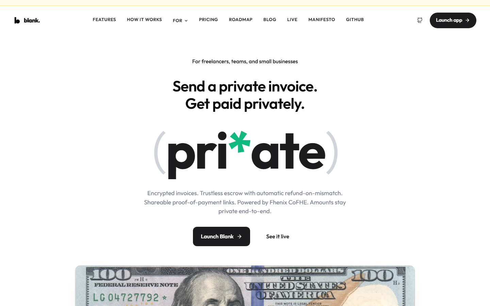
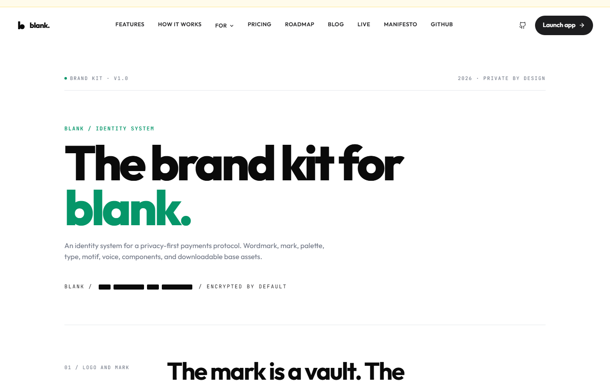

# Blank

## Private amount payments on Ethereum

Public sender. Public receiver. Encrypted amount.

**Same chain. Same finality. Different visibility.**

Live app: https://www.myblank.app

<!--
Speaker note:
Blank is not trying to hide who paid whom. It keeps the blockchain useful for
settlement and audit, while encrypting the commercial detail that does not need
to be public forever: the amount.
-->

---

# The Problem

Public blockchain payments expose business data by default.

| Payment type | What becomes public |
| --- | --- |
| Payroll | Salaries and contractor rates |
| Invoices | Vendor pricing and customer spend |
| Fundraising | Contribution size and campaign progress |
| Commerce | Purchase amounts and buyer behavior |
| Treasury | Run rate and operating cost map |

Traditional payments do not publish every amount to the world.

On-chain payments do.

---

# The Insight

Not every privacy problem needs sender anonymity.

For normal payments, the urgent privacy leak is often the amount.

```text
Public chain today:
0x1111 -> 0x2222: 5,200.00 USDC

Blank:
0x1111 -> 0x2222: ████.██ USDC
```

Blank keeps the payment relationship public and encrypts the number.

---

# Blank's Model

## Public counterparties. Private amount.

| Field | Visibility |
| --- | --- |
| Sender | Public |
| Receiver | Public |
| Chain | Public |
| Contract | Public |
| Timestamp | Public |
| Amount | Encrypted |
| Balance | Encrypted |
| Threshold result | Public only when revealed |

Blank is not a mixer. It is amount privacy for normal payments.

---

# Why Now

The timing is finally practical.

1. FHE has moved from research into usable application infrastructure.
2. Fhenix CoFHE gives apps a path to compute over encrypted values.
3. Crypto payments are now used for payroll, vendors, contractors, creators,
   and internet-native commerce.
4. The market understands that privacy does not always mean anonymity.

Blank fits the gap:

**Keep settlement public. Keep amounts private.**

---

# Privacy Architecture

Blank uses Fhenix CoFHE to compute over encrypted payment amounts.

```text
User enters amount
      |
      v
Browser encrypts with TFHE WASM
      |
      v
CoFHE verifies encrypted input
      |
      v
Contract stores and computes on ciphertext
      |
      v
Permitted parties decrypt through access permits
```

Plaintext amounts are encrypted before they touch the chain.

---

# What The Chain Can Still Do

Encryption does not remove settlement logic.

Blank contracts can still:

- Add encrypted balances.
- Match encrypted invoice amounts.
- Compare encrypted campaign totals with encrypted goals.
- Select sealed-bid auction winners.
- Route encrypted escrow release or refund.
- Publish a proof verdict without exposing the underlying balance.

The chain enforces rules without learning the amount.

---

# Product Surface

Blank turns private amount payments into reusable workflows.

| Surface | What it proves |
| --- | --- |
| Send | Private amount P2P payment |
| Invoice | Vendor gets paid without exposing invoice size |
| Request | Recipient can request a private payment |
| Payroll | Team members do not see each other's pay |
| Gifts | Claimable encrypted gift envelopes |
| Claim links | Payment URLs with bearer, email, or wallet gates |
| Storefront | Private payment commerce and sealed-bid listings |
| Crowdfund | Encrypted goals and encrypted contributions |
| Proofs | Prove balance or income above a threshold |
| Escrow | Encrypted amount escrow |
| Swap and Bridge | External asset movement on supported testnets |

---

# Public Links

Blank makes private payments shareable.

```text
/i/:invoiceId
/v/:proofId
/claim/:chainId/:linkId#secret
/shop/:chainId/:listingId
/fund/:chainId/:campaignId
/escrow/:chainId/:escrowId
```

A link can be public.

The amount does not have to be.

This is how Blank moves from wallet feature to payment infrastructure.

---

# User Experience

Blank should feel like a payment app first.

```text
Connect wallet
    |
Mint, bridge, or fund test assets
    |
Shield into encrypted balance
    |
Send, invoice, request, claim, buy, or contribute
    |
Confirm in wallet
    |
See success state, share URL, activity row, or proof card
```

The user does not need to understand FHE to make a private amount payment.

---

# UX Proof

The product includes clear transaction states:

- Encrypting amount
- Generating proof
- Submitting transaction
- Waiting for confirmation
- Settled state
- Shareable URL or new activity card

Every major surface is designed around visible progress and explicit outcomes.

Visuals:



---

# Technical Execution

Blank is a full-stack encrypted payment app.

| Layer | Stack |
| --- | --- |
| Frontend | React, Vite, wagmi, viem |
| Wallets | Standard EVM wallets, Rabby path, passkey smart accounts |
| FHE | Fhenix CoFHE, TFHE WASM, encrypted handles |
| Contracts | Vault, hubs, claim links, storefront, crowdfund, escrow |
| Account abstraction | ERC-4337 smart account, paymaster path, self-pay gas path |
| Data | Chain settlement plus Supabase indexing for fast UI reads |
| Deployment | Vercel custom domain, CI for app and contracts |

---

# Innovation And Originality

Most crypto privacy products start with anonymity.

Blank starts with a practical business problem:

**Amounts should not be public forever.**

What is original:

- Public counterparty, private amount model.
- FHE used inside normal payment workflows.
- Shareable private payment URLs.
- Encrypted invoices, requests, storefronts, crowdfunds, proofs, and escrow.
- Public verification artifacts backed by chain state.

---

# Market Potential

Blank targets payment flows where public amounts create real cost.

Primary early markets:

- Crypto payroll teams
- DAOs and contributor networks
- Agencies and freelancers
- B2B vendors
- Creator businesses
- Fundraising teams
- On-chain commerce builders
- Wallet and payment platforms

The wedge starts with private invoices, private requests, and claim links.

The platform expands into encrypted commerce and developer payment rails.

---

# Competitive Position

| Category | What it focuses on | Blank's difference |
| --- | --- | --- |
| Mixers | Hiding sender and receiver links | Blank keeps counterparties public |
| Shielded pools | Private account or pool state | Blank focuses on payment workflows |
| ZK proofs | Proving statements | Blank computes on encrypted values |
| Private ledgers | Closed-system privacy | Blank keeps public-chain settlement |

Blank is not trying to make Ethereum invisible.

Blank is making payment amounts private.

---

# Trust Position

Blank's privacy claim is narrow and clear.

Blank hides:

- Amounts
- Encrypted balances
- Gift values
- Contribution amounts
- Bid amounts
- Escrow amounts
- Payroll row amounts

Blank does not hide:

- Sender
- Receiver
- Contract
- Chain
- Timestamp
- Transaction hash

That clarity is a feature.

---

# Current Status

Blank is live on public testnet.

Live app:

https://www.myblank.app

Published assets:

- Whitepaper: `/whitepaper`
- Brand kit: `/brand-kit`
- Live page: `/live`
- Manifesto: `/manifesto`
- Public proof links: `/v/:proofId`

Supported public testnets:

- Base Sepolia
- Ethereum Sepolia

---

# Proof Of Execution

Blank is shipped, not just proposed.

- Live custom domain.
- Public whitepaper.
- Public brand kit.
- Public claim, shop, fund, escrow, invoice, and proof URL patterns.
- Standard EVM wallet support.
- Passkey smart-account path.
- CI for app and contracts.
- Real testnet transactions through wallet confirmation.
- Public app surfaces for payments, commerce, proofs, and business flows.

The product can be opened and tested today.

---

# Founder

## Pratik

- Master's in blockchain from India.
- Author of *The Blockchain Path*.
- Hosted offline Web3 events at two universities in India.
- Contributed to multiple Web3 products.
- Experience across product, marketing, and community.

Why this matters:

Blank sits between hard infrastructure and real adoption.

The founder has worked on both: blockchain systems and the community side of
getting people to care.

---

# Roadmap

Blank's roadmap is gated by proof, not hype.

Near term:

- Keep standard EVM wallet flows stable on supported testnets.
- Continue hardening public links, storefront, crowdfund, escrow, Swap, and
  Bridge.
- Improve cross-user state updates and data truth after refresh.
- Expand mobile transaction QA after desktop paths stay stable.

Before mainnet:

- Third-party audit.
- Mainnet-readiness validation matrix.
- Production RPC, indexer, monitoring, and incident response.
- Legal and compliance review for amount privacy.

---

# What Blank Will Not Be

Blank will not be:

- A mixer.
- A sender anonymity tool.
- A token launch.
- A points farm.
- A speculative yield product.
- A mainnet product before audit.

Blank is payment infrastructure.

Normal payments should not publish private amounts forever.

---

# Ask

Blank is looking for:

- Testnet users.
- Design partners with real payment workflows.
- Crypto payroll, agency, DAO, creator, and commerce teams.
- FHE ecosystem support.
- Audit and security partners before mainnet.

Live app:

https://www.myblank.app

---

# Closing

Ethereum made settlement public by default.

Blank keeps public settlement.

Blank keeps public counterparties.

Blank encrypts the amount.

**Same chain. Same finality. Different visibility.**

---

# Appendix A: FHE Operations

| Operation | Used for |
| --- | --- |
| `FHE.add` | Balances, payroll totals, crowdfund raised amount |
| `FHE.eq` | Invoice and fixed-price amount matching |
| `FHE.gte` | Crowdfund goal verdicts and threshold proofs |
| `FHE.gt` | Sealed-bid auction comparisons |
| `FHE.select` | Branching without leaking through reverts |
| `FHE.allow` | Scoped decrypt access |
| `FHE.allowSender` | Sender decrypt access |
| `FHE.allowTransient` | One-transaction cross-contract movement |

The product does not hide a number in a database.

It computes over encrypted state.

---

# Appendix B: Contract Surface

Core contracts and roles:

- `FHERC20Vault`: encrypted balances, shield, unshield, transfer.
- `BusinessHub`: invoices, payroll, and business payment flows.
- `PaymentReceipts`: public receipts and threshold proofs.
- `ClaimLinks`: bearer, email-bound, and address-bound claim URLs.
- `Storefront`: fixed price, pay-what-you-want, sealed-bid listings.
- `EncryptedCrowdfund`: encrypted goal and encrypted contributions.
- `EncryptedEscrow`: encrypted amount escrow.
- `BlankAccount`: ERC-4337 smart account for passkey users.
- `BlankPaymaster`: sponsored gas path when available.

---

# Appendix C: Wallet Paths

| Path | Purpose |
| --- | --- |
| Standard EVM wallet | Crypto-native users who already use a wallet |
| Rabby EOA path | Primary desktop QA path for wallet-confirmed flows |
| Passkey smart account | No-extension onboarding path |
| Paymaster | Sponsored UserOps when available |
| Self-pay gas | Smart-account fallback when sponsorship is unavailable |

One product surface, multiple wallet paths.

---

# Appendix D: Public Link Shapes

```text
/i/:invoiceId
/r/:requestId
/v/:proofId
/claim/:chainId/:linkId#secret
/shop/:chainId/:listingId
/fund/:chainId/:campaignId
/escrow/:chainId/:escrowId
```

Each link turns a private amount payment into a product workflow.

---

# Appendix E: Brand Direction

Blank's visual identity should signal privacy without looking like a dark-web
tool.

Principles:

- Redaction as the motif.
- Black and white foundation.
- Controlled green accent.
- Clear product copy.
- No anonymous-cash aesthetic.
- No speculative token language.
- No mainnet overclaim.

Visual:


